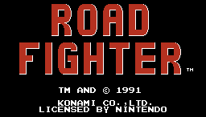

# Road-Fighter

Juego basado en Road-Fighter programado en Python usando PyGame.

<div id = "photo" align = "center">
    
</div>

## Materia: *Ingenieria del Software*

<div id="photo_2" align = "center">
    
</div>

### Members

- Rodrigo Vargas
- Simón Saillen
- Kevin Bejarano
- Luigi Pandolfi

## How to Play

1. Install all the dependencies:

Open the terminal on the project folder and run the next command:

```bash
pip install -r requirements.txt
```

2. Run the file *run.py*:

You can do this on the terminal using the next command:

```bash
python3 run.py
```

Or inside the src folder, run the next command:

```bash
python3 main.py
```